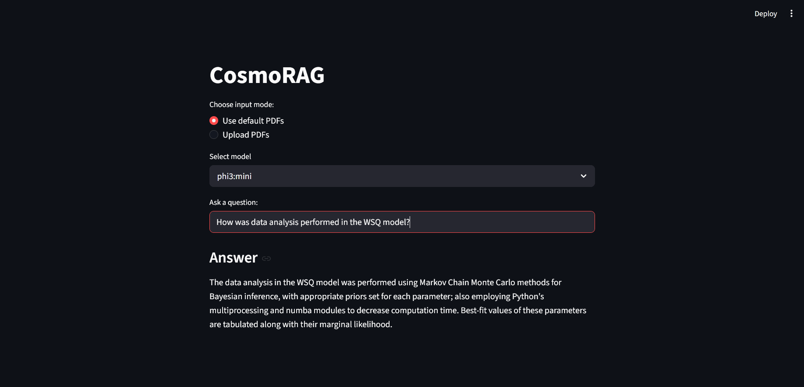

# COSMO-RAG

A Retrieval-Augmented Feneration (RAG) system for querying cosmology research papers.

## Features

- Multi-document PDF ingestion
- Section aware retrieval (Methods, Results, etc.)
- Hybrid search (semantic + keyword)
- Local LLM
- Interactive Streamlit UI

## Working

1. PDFs are read and split into sections.
2. Split sections are chunked and embedded.
3. FAISS retrieves relevant chunks according to query.
4. Retrieved chunks are further filtered based on section and other metrics.
5. LLM generates answers.

## Example Query

> How was data analysis performed in the WSQ model?

## Demo

<!--  -->


## Instructions

The first step to run this locally is to install ollama from the [official website](https://ollama.com/).
Then install **phi3:mini** and **gemma:2b** into ollama.

```
ollama pull phi3:mini
ollama pull gemma:2b
```

Then clone this repo, go into the base folder and run :

```bash
pip install -e .
streamlit run app.py
```
